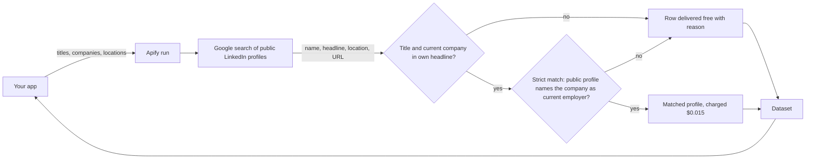

# LinkedIn People Search Scraper Docs

[](https://apify.com/agnes.developer.queen/linkedin-people-search-scraper)
[](LICENSE)

Consumer documentation and integration examples for the LinkedIn People Search Scraper actor on Apify. Job titles, companies and locations in, public LinkedIn profiles out. No LinkedIn login, no cookies. You pay $0.015 per profile and only when the match is confirmed.

The actor lives on Apify Store: https://apify.com/agnes.developer.queen/linkedin-people-search-scraper

The actor source is not in this repo. This repo holds the README, the input and output shape, and working examples in curl, Node and Python that call the public Apify API. Use it to wire the actor into your own code.

## What it does

You send a list of job titles, optionally a list of companies and locations. The actor searches Google for public LinkedIn profiles that match, reads each person's own headline, and returns one row per person: name, headline, location, profile URL, seniority band, department, and whether the row was charged and why.

The charge bar has two steps. First the person's own headline must contain a searched title with a searched company in the employer spot for that title, as in "CFO at Stripe", "CFO | Stripe" or "Stripe CFO". Past and support roles such as "ex-Stripe", "Retired CFO" or "Assistant to the CFO" never count. Second, with strict match on (the default), the actor opens the person's public profile and charges only when the profile is readable and LinkedIn's own profile data names a searched company as a current employer. Rows that fail either step are still delivered, free, with the `reason` field saying which part was missing.

Titles match their common forms. A CFO search also finds "Chief Financial Officer", and a "VP of Sales" search also finds "Vice President, Sales" and "SVP of Sales".

What it does not return: email addresses, phone numbers, full work history, skills, education, private profiles, people Google does not index, or Sales Navigator data.

## Architecture



## Request flow

```mermaid
sequenceDiagram
    participant App as Your App
    participant API as Apify API
    participant Actor as People Search Actor
    App->>API: POST /acts/agnes.developer.queen~linkedin-people-search-scraper/run-sync-get-dataset-items
    API->>Actor: Start run (actor-start, $0.005)
    Actor->>Actor: Google search per title x company x location
    Actor->>Actor: Headline check: title + current company
    Actor->>Actor: Strict match: fetch public profile, confirm employer
    Actor->>Actor: Charge matched-profile for confirmed rows only
    Actor-->>API: Dataset rows, charged or free with reason
    API-->>App: JSON array of rows
```

## Input

Source: the actor's `.actor/input_schema.json`.

| Field | Type | Default | Meaning |
|---|---|---|---|
| `titles` | array of strings | required | Job titles to search for, 1 to 30, for example `VP of Sales` or `Head of Marketing`. A matched profile is a person whose own LinkedIn headline contains one of these titles. |
| `companies` | array of strings | none | Optional, up to 200. Company names, or LinkedIn company URLs whose URL name is the company name (`linkedin.com/company/stripe`). When set, a matched profile must name one of these companies as the employer for the title in the person's own headline. Past employers and service providers do not count. |
| `locations` | array of strings | none | Optional, up to 20. Cities, regions or countries to narrow the search, for example `San Francisco` or `Germany`. |
| `maxResults` | integer | 50 | Stop after this many profiles are delivered, matched or not, 1 to 2,000. Only matched profiles are charged. |
| `strictMatch` | boolean | true | Before charging for a row, open the person's public profile and confirm it is readable and that LinkedIn's own profile data names a searched company as a current employer. Turn off to charge on the headline alone. |

The example input used by every file in [examples/](examples/):

```json
{
    "titles": ["VP of Sales", "Head of Sales"],
    "companies": ["Stripe"],
    "maxResults": 10
}
```

## Output shape

One row per person found. This is a full record from a real run, copied from the actor's Store README. The same record is in [examples/output.json](examples/output.json).

```json
{
    "fullName": "Patrick Collison",
    "headline": "Stripe CEO",
    "location": "",
    "profileUrl": "https://www.linkedin.com/in/patrickcollison/",
    "isDecisionMaker": true,
    "seniorityBand": "cxo",
    "department": "executive",
    "matchedTitle": "CEO",
    "matchedCompany": "Stripe",
    "verifiedEmployer": "Stripe",
    "profileEmployers": ["Stripe", "Arc Institute"],
    "charged": true,
    "reason": "title in own headline, current employer confirmed on profile",
    "searchedTitles": ["CEO", "CFO"],
    "searchedCompany": "Stripe",
    "searchedLocation": null,
    "scrapedAt": "2026-09-23T22:44:25.660Z"
}
```

Field notes, from the dataset schema:

- `profileUrl` is null when Google hid the link and it could not be resolved.
- `seniorityBand` is one of owner, partner, cxo, vp, director, manager, senior, entry or unknown.
- `matchedTitle` and `matchedCompany` are null on rows that did not pass the headline check.
- `verifiedEmployer` and `profileEmployers` are filled only with strict match. `profileEmployers` is null when the profile was not checked or not readable.
- `charged` is true when the row took a Matched profile event. `reason` says why, for example `current company not confirmed` or `title not in own headline`.

Each run also writes a `RUN_SUMMARY` record to its key-value store.

## Pricing

Pay per event. No subscription, no monthly rental.

| Event | Price | You pay when |
|---|---|---|
| Actor start (`actor-start`) | $0.005 | once per run |
| Matched profile (`matched-profile`) | $0.015 | a person's own headline confirms a title you searched, and their public profile confirms the company you searched as a current employer |
| Any other row | $0 | delivered with `charged: false` and a `reason` |

Worked example: a run that returns 100 confirmed profiles costs 100 x $0.015 + $0.005 = $1.505. If the same run also delivered 60 rows that did not confirm, those 60 cost nothing. That is $15 per 1,000 matched profiles. A 10-profile test with two confirmed matches costs $0.035.

Every Apify account gets $5 of free platform credit each month, which covers the start fee plus more than 300 confirmed profiles at this price.

## Use cases

1. Outbound lists. Take a target account list, find the VP of Sales and Head of Sales at each company, and send only the charged rows to your sequencer.
2. Recruiting. Find CTOs and VPs of Engineering at companies in one city, and skip the people whose headline says "ex-".
3. Account-based marketing. Map the CFO, CMO and Head of Operations at each named account before a campaign.
4. CRM enrichment. For each company in your CRM, look up one title and write back the matched profile URL and seniority band.
5. Investor research. Find the founders, CEOs and CFOs at a portfolio or a pipeline of companies.

## Examples

Each file runs the actor with the example input above, reads `APIFY_TOKEN` from the environment and prints the rows.

- [examples/curl.sh](examples/curl.sh): one POST to `run-sync-get-dataset-items`, returns the dataset in the same request.
- [examples/node.js](examples/node.js): `apify-client` for Node, `client.actor().call()` then `dataset.listItems()`.
- [examples/python.py](examples/python.py): `apify-client` for Python, `client.actor().call()` then `dataset.iterate_items()`.
- [examples/input.json](examples/input.json): the example input.
- [examples/output.json](examples/output.json): one real output record.

Filter on `charged` in your own code if you only want confirmed matches. The actor also works from Make, n8n, Zapier and Clay through the Apify app or an HTTP step.

## Authentication

You need an Apify API token. Get one at https://console.apify.com/account/integrations.

Set it as an environment variable:

```
APIFY_TOKEN=apify_api_xxxxxxxxxxxxxxxxxxxxx
```

The examples in this repo read from `APIFY_TOKEN`. The curl example sends it as a Bearer header, not a query string.

## Related actors

Same author, same pay-per-event model.

- [LinkedIn Company Scraper](https://github.com/agnesthedeveloper/linkedin-company-scraper): company pages to JSON
- [LinkedIn Jobs Scraper](https://github.com/agnesthedeveloper/linkedin-jobs-scraper): job postings by title, company and location
- [LinkedIn Ad Library Scraper](https://github.com/agnesthedeveloper/linkedin-ad-library-scraper): ads from the LinkedIn Ad Library
- [Google Ads Transparency Scraper](https://github.com/agnesthedeveloper/google-ads-transparency-scraper): ads from the Google Ads Transparency Center
- [agnes-apify-actors](https://github.com/agnesthedeveloper/agnes-apify-actors): hub listing every actor

## Support

Found a bug or a wrong charge? Open an issue on the [Issues tab of the Store page](https://apify.com/agnes.developer.queen/linkedin-people-search-scraper/issues) with the run ID.

## License

MIT, see [LICENSE](LICENSE). The license covers the documentation and examples in this repo. The actor itself is hosted on Apify and its source is not included here.
